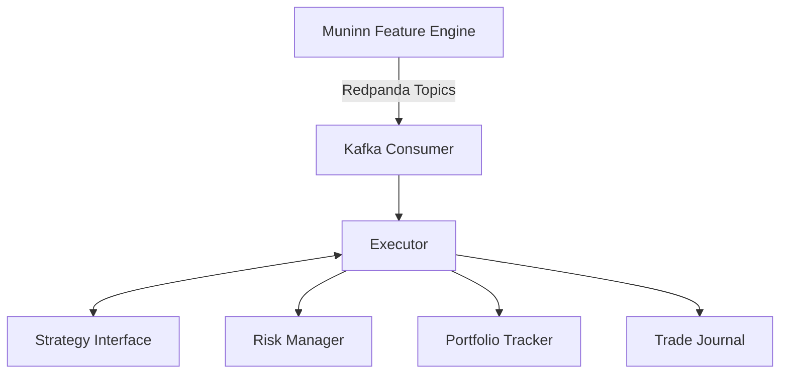

# Huginn — Quantitative Strategy Execution Engine

> *Named after Odin's raven of "thought."*
> *Huginn* consumes deterministic features from **Muninn** ("memory") and executes paper-trading strategies.

## Architecture



Huginn is a **downstream companion** to [Muninn](https://github.com/lgreene/muninn). It strictly adheres to Muninn's architectural principle: *Muninn observes and computes; Huginn thinks and acts.*

| Layer | Responsibility |
|---|---|
| **Kafka Consumer** | Multi-topic fan-in consumer that subscribes to Muninn's Redpanda topics |
| **Strategy** | Pluggable interface (`OnFeature → []Order`) implementing quantitative signal logic |
| **Risk Manager** | Pre-trade risk controls (Max Drawdown, Daily Loss Limit, Position Limits) |
| **Executor** | Simulates order fills with configurable slippage and transaction costs |
| **Portfolio** | Thread-safe position tracker with realized/unrealized PnL accounting |
| **Trade Journal** | Append-only JSONL or Postgres-backed storage for crash recovery |

## Strategies

Four strategies are bundled. Pick one via `strategy.name` in the config (`obi`, `vpin`, `ema_crossover`, `vwap_deviation`). See `docs/ROADMAP.md` Phase 2 for the calibration story and per-strategy failure modes.

### OBI Threshold (Mean-Reversion)
Monitors Order Book Imbalance. When extreme buy pressure is detected (OBI > threshold), it sells expecting reversion. Vice versa for extreme sell pressure. Source: `internal/strategy/obi_threshold.go`.

### VPIN Breakout (Momentum)
Monitors Volume-Synchronized Probability of Informed Trading. When VPIN exceeds the threshold, it enters in the direction of informed flow with a configurable cooldown. Source: `internal/strategy/obi_threshold.go` (lines 87+; will move to its own file in Phase 2).

### EMA Crossover (Trend-Following)
Two exponential moving averages with configurable fast/slow periods. Enters long on fast-over-slow crossover, short on the reverse. Source: `internal/strategy/ema_crossover.go`.

### VWAP Deviation (Mean-Reversion on VWAP)
Compares the current price to the rolling VWAP and trades reversion when the deviation exceeds `threshold_pct`. Source: `internal/strategy/vwap_deviation.go`.

## Docker Quick Start

The easiest way to run Huginn is via Docker Compose, which spins up the engine alongside a local Redpanda broker:

```bash
# Start Huginn and Redpanda
docker-compose up -d

# Check Huginn logs
docker-compose logs -f huginn

# Verify health status and portfolio snapshot
curl http://localhost:8081/healthz
```

## Configuration

Huginn is configured via YAML profiles (e.g., `configs/default.yaml`). You can override any value using the corresponding environment variable.

| YAML Key | Environment Variable | Description |
|---|---|---|
| `kafka.brokers` | `KAFKA_BROKERS` | List of Redpanda/Kafka brokers |
| `kafka.topics` | `KAFKA_TOPICS` | List of feature topics to consume |
| `kafka.group_id` | `KAFKA_GROUP_ID` | Kafka consumer group ID |
| `strategy.name` | `STRATEGY_NAME` | Strategy to run: `obi`, `vpin`, `ema_crossover`, or `vwap_deviation` |
| `strategy.threshold` | `STRATEGY_THRESHOLD` | Signal activation threshold (OBI / VPIN / VWAP %) |
| `strategy.order_size` | `STRATEGY_ORDER_SIZE` | Order size per signal |
| `strategy.fast_period` | `STRATEGY_FAST_PERIOD` | EMA fast period (ema_crossover) |
| `strategy.slow_period` | `STRATEGY_SLOW_PERIOD` | EMA slow period (ema_crossover) |
| `strategy.cooldown_ms` | `STRATEGY_COOLDOWN_MS` | Re-entry cooldown in ms (vpin) |
| `executor.transaction_cost_bps` | `EXECUTOR_TX_COST_BPS` | Simulated transaction cost (basis points) |
| `executor.slippage_bps` | `EXECUTOR_SLIPPAGE_BPS` | Simulated slippage (basis points) |
| `executor.live_execution` | `LIVE_EXECUTION` | Publish order intents to Sleipnir over Kafka instead of paper-filling |
| `kafka.intents_topic` | `KAFKA_INTENTS_TOPIC` | Topic for outbound order intents (default `executions.intents.v1`) |
| `kafka.fills_topic` | `KAFKA_FILLS_TOPIC` | Topic for inbound fills from Sleipnir (default `executions.fills.v1`) |
| `capital.initial_cash` | `CAPITAL_INITIAL_CASH` | Initial capital (USDT) |
| `risk.max_drawdown_pct` | `RISK_MAX_DRAWDOWN_PCT` | Maximum drawdown percentage (e.g. 0.20 for 20%) |
| `risk.daily_loss_limit` | `RISK_DAILY_LOSS_LIMIT` | Maximum daily loss allowed |
| `risk.position_limit_hard` | `RISK_POSITION_LIMIT_HARD` | Hard position limit (gross notional) |
| `database.enabled` | `DATABASE_ENABLED` | Use Postgres for journal recovery instead of JSONL |
| `database.url` | `DATABASE_URL` | Postgres DSN |
| `server.port` | `SERVER_PORT` | Port for observability server (default `8081`) |

You can specify a config file via the CLI:
```bash
./huginn --config configs/aggressive.yaml
```

## Testing

```bash
go test ./...
go vet ./...
```

## Non-Goals

Huginn is a **paper-trading research engine**. See `docs/ROADMAP.md` for the full non-goals list. In particular:
- **Huginn never opens an exchange socket.** Live mode publishes order intents to [Sleipnir](https://github.com/lgreene/sleipnir) over Kafka; Sleipnir talks to the venue. Huginn only ever speaks to Sleipnir.
- **Not a feature-engineering library.** Features come from [Muninn](https://github.com/lgreene/muninn).
- **Not a multi-venue smart-order router.** One Sleipnir, one venue.
- **Not a portfolio-optimization library.** No mean-variance, no factor models. Position sizing is per-strategy notional throttling.
- **Not a research notebook environment.** Analytics live in [muninn-py](https://github.com/lgreene/muninn-py).
- **No wallet or custody management. No financial advice.**

See `docs/ROADMAP.md` for current state, planned phases, and explicit non-goals.
