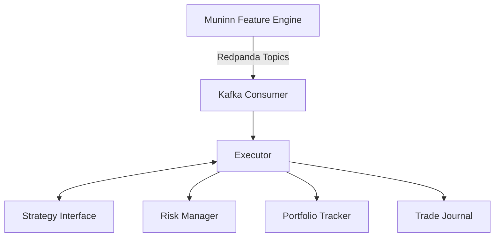

# Huginn — Quantitative Strategy Execution Engine

[](https://github.com/lgreene03/huginn/actions/workflows/ci.yml)
[](https://lgreene03.github.io/huginn)
[](LICENSE)

> *Named after Odin's raven of "thought."*
> *Huginn* consumes deterministic features from **Muninn** ("memory") and executes paper-trading strategies.
> Part of the **[Norse Stack](https://github.com/lgreene03/norse-stack)**.

**[Full documentation →](https://lgreene03.github.io/huginn)**

## Architecture



Huginn is a **downstream companion** to [Muninn](https://github.com/lgreene03/muninn). It strictly adheres to Muninn's architectural principle: *Muninn observes and computes; Huginn thinks and acts.*

| Layer | Responsibility |
|---|---|
| **Kafka Consumer** | Multi-topic fan-in consumer that subscribes to Muninn's Redpanda topics |
| **Strategy** | Pluggable interface (`OnFeature → []Order`) implementing quantitative signal logic |
| **Risk Manager** | Pre-trade risk controls (Max Drawdown, Daily Loss Limit, Position Limits) |
| **Executor** | Simulates order fills with configurable slippage and transaction costs |
| **Portfolio** | Thread-safe position tracker with realized/unrealized PnL accounting |
| **Trade Journal** | Append-only JSONL or Postgres-backed storage for crash recovery |

## Strategies

Six strategies are bundled. Pick one via `strategy.name` in the config (`obi`, `vpin`, `vwap_deviation`, `ema_crossover`, `ou`, `composite`). See `docs/ROADMAP.md` Phase 2 for the calibration story and per-strategy failure modes.

### OBI Threshold (Mean-Reversion)
Monitors Order Book Imbalance. When extreme buy pressure is detected (OBI > threshold), it sells expecting reversion. Vice versa for extreme sell pressure. Source: `internal/strategy/obi_threshold.go`.

### VPIN Breakout (Momentum)
Monitors Volume-Synchronized Probability of Informed Trading. When VPIN exceeds the threshold, it enters in the direction of informed flow with a configurable cooldown. Source: `internal/strategy/vpin_breakout.go`.

### EMA Crossover (Trend-Following)
Two exponential moving averages with configurable fast/slow periods. Enters long on fast-over-slow crossover, short on the reverse. Source: `internal/strategy/ema_crossover.go`.

### VWAP Deviation (Mean-Reversion on VWAP)
Compares the current price to the rolling VWAP and trades reversion when the deviation exceeds `threshold_pct`. Source: `internal/strategy/vwap_deviation.go`.

### OU Reversion (Statistical Mean-Reversion)
Fits an Ornstein-Uhlenbeck (AR(1)) process to a rolling mid-price window by OLS, then enters when the standardized deviation `|z|` exceeds the entry band (`strategy.threshold`). `strategy.slow_period` sets the rolling OLS window. Stateful — its rolling window and open position survive a restart. Source: `internal/strategy/ou_reversion.go`.

### Composite (Pluggable-Alpha Blend)
Blends a weighted set of `Alpha` signals (OBI + multi-timeframe momentum + EMA mean-reversion by default) into one signed score, applies `strategy.threshold` as the `|combined score|` entry band, and routes the entry through the same cost-hurdle, signed-position, and risk path as OBI. Stateful. Source: `internal/strategy/composite.go`.

### Adding your own alpha
The signal layer is **pluggable**: a new signal is one small type implementing the `Alpha` interface (`internal/strategy/alpha.go`) plus one line of composite config — no change to the executor, risk manager, portfolio, or cost model. The bundled alphas live in `internal/strategy/alphas_bundled.go` and are wired in `internal/strategy/composite.go`. See [`docs/ADDING_AN_ALPHA.md`](docs/ADDING_AN_ALPHA.md) for the end-to-end guide.

## Research gateway

`cmd/research` is a standalone HTTP service that runs heavy walk-forward + PBO + Deflated-Sharpe validation **out of the live trading process**. It reuses the same `internal/research` engine as `cmd/walkforward`, so a gateway run reproduces the CLI's result, but executes as a separate sidecar that owns no Kafka or Postgres dependency — it just replays a JSONL dataset on disk.

- **Port:** `8094` (override with `RESEARCH_PORT`).
- **Submit a run:** `POST /api/research/runs` with `{"strategy":"obi|ou|composite","thresholds":[...],"folds":N}`. Returns `202 {id, status:"running"}` and runs the walk-forward asynchronously.
- **Poll results:** `GET /api/research/runs` (newest-first summaries) and `GET /api/research/runs/{id}` (full record with `oosFoldsProfitable`, `totalOOSPnL`, `pbo`, `deflatedSharpe`). `GET /healthz` for liveness.
- **Data:** replays `RESEARCH_DATA_PATH` (default `data/btc_test.jsonl`, the committed fixture). Finished runs persist to `RESEARCH_RESULTS_DIR` (default `data/research/`) and reload on restart.

```bash
# Run the gateway against the bundled fixture (no Kafka/Postgres needed)
go run ./cmd/research
# In another shell:
curl -s localhost:8094/healthz
curl -s -X POST localhost:8094/api/research/runs \
  -d '{"strategy":"obi","thresholds":[0.5,0.6,0.7],"folds":4}'
```

Build the container image from `Dockerfile.research`. The compose wiring for the research/mimir/forseti services lives in [norse-stack](https://github.com/lgreene03/norse-stack).

## Docker Quick Start

The easiest way to run Huginn is via Docker Compose, which spins up the engine alongside a local Redpanda broker:

```bash
# Start Huginn and Redpanda
docker-compose up -d

# Check Huginn logs
docker-compose logs -f huginn

# Verify health status and portfolio snapshot
# (compose publishes Huginn on host port 8083 → container 8081)
curl http://localhost:8083/healthz
```

## Configuration

Huginn is configured via YAML profiles (e.g., `configs/default.yaml`). You can override any value using the corresponding environment variable.

| YAML Key | Environment Variable | Description |
|---|---|---|
| `kafka.brokers` | `KAFKA_BROKERS` | List of Redpanda/Kafka brokers |
| `kafka.topics` | `KAFKA_TOPICS` | List of feature topics to consume |
| `kafka.group_id` | `KAFKA_GROUP_ID` | Kafka consumer group ID |
| `feed.source` | `FEED_SOURCE` | Feature source: `kafka` (default) or `stream` (Muninn SSE feature stream, [ADR-0009](https://github.com/lgreene03/muninn/blob/main/docs/adr/0009-streaming-features-sse.md)) |
| `feed.stream_url` | `FEED_STREAM_URL` | Muninn base URL for the SSE source (default `http://localhost:8080`) |
| `feed.stream_feature` | `FEED_STREAM_FEATURE` | Restrict the SSE stream to one feature name (`?feature=`); empty streams all |
| `strategy.name` | `STRATEGY_NAME` | Strategy to run: `obi`, `vpin`, `vwap_deviation`, `ema_crossover`, `ou`, or `composite` |
| `strategy.threshold` | `STRATEGY_THRESHOLD` | Signal activation threshold (OBI / VPIN / VWAP %) |
| `strategy.order_size` | `STRATEGY_ORDER_SIZE` | Order size per signal |
| `strategy.fast_period` | `STRATEGY_FAST_PERIOD` | EMA fast period (ema_crossover) |
| `strategy.slow_period` | `STRATEGY_SLOW_PERIOD` | EMA slow period (ema_crossover) |
| `strategy.cooldown_ms` | `STRATEGY_COOLDOWN_MS` | Re-entry cooldown in ms (vpin) |
| `executor.transaction_cost_bps` | `EXECUTOR_TX_COST_BPS` | Simulated transaction cost (basis points) |
| `executor.slippage_bps` | `EXECUTOR_SLIPPAGE_BPS` | Simulated slippage (basis points) |
| `executor.live_execution` | `LIVE_EXECUTION` | Publish order intents to Sleipnir over Kafka instead of paper-filling |
| `kafka.intents_topic` | `KAFKA_INTENTS_TOPIC` | Topic for outbound order intents (default `executions.intents.v1`) |
| `kafka.fills_topic` | `KAFKA_FILLS_TOPIC` | Topic for inbound fills from Sleipnir (default `executions.fills.v1`) |
| `capital.initial_cash` | `CAPITAL_INITIAL_CASH` | Initial capital (USDT) |
| `risk.max_drawdown_pct` | `RISK_MAX_DRAWDOWN_PCT` | Maximum drawdown percentage (e.g. 0.20 for 20%) |
| `risk.daily_loss_limit` | `RISK_DAILY_LOSS_LIMIT` | Maximum daily loss allowed |
| `risk.position_limit_hard` | `RISK_POSITION_LIMIT_HARD` | Hard position limit (gross notional) |
| `database.enabled` | `DATABASE_ENABLED` | Use Postgres for journal recovery instead of JSONL |
| `database.url` | `DATABASE_URL` | Postgres DSN |
| `database.max_conns` | `DATABASE_MAX_CONNS` | Max Postgres connection-pool connections |
| `database.min_conns` | `DATABASE_MIN_CONNS` | Min warm connections in pool |
| `database.max_conn_lifetime` | `DATABASE_MAX_CONN_LIFETIME` | Max connection lifetime (e.g. `1h`) |
| `database.max_conn_idle_time` | `DATABASE_MAX_CONN_IDLE_TIME` | Idle connection eviction time (e.g. `5m`) |
| `executor.fill_latency_ms` | `EXECUTOR_FILL_LATENCY_MS` | Simulated fill timestamp delay in ms (backtest realism) |
| `risk.staleness_timeout` | `RISK_STALENESS_TIMEOUT` | Auto-halt if no feature event within this duration |
| `risk.auto_resume_after_staleness` | `RISK_AUTO_RESUME_AFTER_STALENESS` | Auto-resume when a fresh event arrives after staleness halt |
| `server.port` | `SERVER_PORT` | Port for observability server (default `8081`) |
| _(env only)_ | `HUGINN_API_TOKEN` | Bearer token for mutating control endpoints. **Fails closed:** when unset, those endpoints return `503` (the control plane is locked); set it to enable them. Read-only endpoints are always open. |
| _(env only)_ | `HUGINN_DASHBOARD_ORIGIN` | Allowed CORS origin echoed in `Access-Control-Allow-Origin` (default `http://localhost:8084`). Never `*`. |

### Control-plane security

Mutating HTTP endpoints — `POST /api/breaker/trigger`, `POST /api/breaker/reset`,
`POST /api/fills/mock`, and `PUT /api/strategy/config` — require a bearer token:

```
Authorization: Bearer <HUGINN_API_TOKEN>
```

These endpoints **fail closed**. With no `HUGINN_API_TOKEN` configured they return
`503 Control plane locked`, so an unconfigured deployment can never leave the
breaker or mock-fill controls open. Read-only endpoints (`/healthz`, `/readyz`,
`/api/snapshot`, `/api/snapshot/history`, `/api/stream`, `/version`, `/metrics`)
stay open and unauthenticated.

CORS is scoped to a single dashboard origin via `HUGINN_DASHBOARD_ORIGIN`
(default `http://localhost:8084`); the wildcard `*` is never sent. In the Norse
stack the token is provided by the `norse-stack` compose file.

### HTTP API reference

The full HTTP surface is documented as a static OpenAPI 3 spec at
[`api/openapi.yaml`](api/openapi.yaml) — covering `/healthz`, `/readyz`,
`/version`, `/metrics`, `/api/snapshot`, `/api/snapshot/history`, `/api/stream`,
`/api/breaker/*`, `/api/fills/mock`, and `GET`/`PUT /api/strategy/config`,
including the bearer-auth scheme on the mutating endpoints. Open it in any
OpenAPI viewer (Swagger UI, Redocly, the Stoplight VS Code extension).

You can specify a config file via the CLI:
```bash
./huginn --config configs/aggressive.yaml
```

## Building from source

```bash
# Plain build — binary reports VERSION=dev, GIT_SHA=unknown, BUILD_TIME=unknown
go build -o huginn ./cmd/huginn

# Stamped build — git SHA + UTC build time baked in via -ldflags -X.
# The Makefile fills GIT_SHA/BUILD_TIME from git/date by default:
make build

# Or stamp manually:
go build -ldflags "\
  -X github.com/lgreene03/huginn/internal/version.Version=v0.1.0 \
  -X github.com/lgreene03/huginn/internal/version.GitSHA=$(git rev-parse --short HEAD) \
  -X github.com/lgreene03/huginn/internal/version.BuildTime=$(date -u +%Y-%m-%dT%H:%M:%SZ)" \
  -o huginn ./cmd/huginn
```

The stamped values surface in the startup log and at `GET /version`:

```bash
curl http://localhost:8081/version
# {"version":"v0.1.0","git_sha":"e95e691","build_time":"2026-06-21T10:00:00Z"}
```

The container image stamps the same values from `--build-arg`:

```bash
make docker          # passes VERSION/GIT_SHA/BUILD_TIME through to the build
# or, via compose:
GIT_SHA=$(git rev-parse --short HEAD) \
  BUILD_TIME=$(date -u +%Y-%m-%dT%H:%M:%SZ) \
  docker compose build huginn
```

## Testing

```bash
go test ./...
go vet ./...

# End-to-end smoke test (boots Docker, pushes OBI event, verifies strategy fires)
bash scripts/smoke.sh
```

## Non-Goals

Huginn is a **paper-trading research engine**. See `docs/ROADMAP.md` for the full non-goals list. In particular:
- **Huginn never opens an exchange socket.** Live mode publishes order intents to [Sleipnir](https://github.com/lgreene03/sleipnir) over Kafka; Sleipnir talks to the venue. Huginn only ever speaks to Sleipnir.
- **Not a feature-engineering library.** Features come from [Muninn](https://github.com/lgreene03/muninn).
- **Not a multi-venue smart-order router.** One Sleipnir, one venue.
- **Not a portfolio-optimization library.** No mean-variance, no factor models. Position sizing is per-strategy notional throttling.
- **Not a research notebook environment.** Analytics live in [muninn-py](https://github.com/lgreene03/muninn-py).
- **No wallet or custody management. No financial advice.**

See `docs/ROADMAP.md` for current state, planned phases, and explicit non-goals.

## License

[Apache License 2.0](LICENSE).
