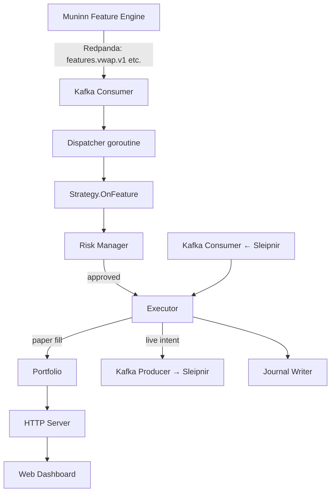

# Architecture

## Overview



Huginn is a **single-process, single-strategy engine**. The hot path — feature dispatch → strategy signal → risk check → executor fill → portfolio update — runs on a single goroutine. No intra-process parallelism on the critical path; observability and journal writes are the only concurrent operations.

---

## Components

### Kafka Consumer (`internal/kafka/`)

Multi-topic fan-in consumer. Each configured topic runs its own goroutine reading from `kafka-go`. Events are forwarded to a shared `chan model.FeatureEvent`. The dispatcher goroutine drains this channel sequentially — **`OnFeature` is always called from a single goroutine.**

Key configuration: `kafka.brokers`, `kafka.topics`, `kafka.group_id`.

### Strategy (`internal/strategy/`)

A Go struct implementing the `Strategy` interface:

```go
type Strategy interface {
    OnFeature(event model.FeatureEvent) []model.Order
}
```

Optionally also implements `Stateful` for crash-recovery:

```go
type Stateful interface {
    MarshalState() ([]byte, error)
    RestoreState([]byte) error
}
```

See [Strategies](strategies.md) for the four bundled strategies.

### Risk Manager (`internal/risk/`)

Pre-trade controls applied before every fill. Rejects orders that would breach:

- Peak-trailing drawdown limit
- Daily loss limit (UTC-day boundary)
- Gross position limit
- Volatility-scaled position limit (CV of last 30 fill prices)

Also manages manual halt/resume via circuit breaker and a feature-staleness auto-halt watchdog.

See [Risk Model](risk-model.md) for complete details.

### Executor (`internal/executor/`)

Dual-mode fill engine:

- **Paper mode** (default): simulates fills with configurable slippage and transaction cost using the feature event's `microPrice`/`value` or `bidPrice`/`askPrice` when available.
- **Live mode** (`LIVE_EXECUTION=true`): publishes `model.OrderIntent` to `executions.intents.v1` (consumed by Sleipnir) and listens on `executions.fills.v1` for fills from Sleipnir.

Dynamic config updates via `PUT /api/strategy/config` call `executor.UpdateConfig` without a restart.

### Portfolio (`internal/portfolio/`)

Thread-safe FIFO average-cost position book. Tracks:

- Per-instrument position (quantity + average cost)
- Realized PnL (on sell/cover)
- Unrealized PnL (marked against last feature price via `LastMarkPrice`)
- Total value = `InitialCash + RealizedPnL + UnrealizedPnL`

### Journal (`internal/journal/`)

Append-only storage with two backends:

| Backend | When to use |
|---|---|
| **JSONL** (`journal/jsonl.go`) | Local dev, demos, ephemeral runs |
| **Postgres** (`journal/postgres.go`) | Default; recommended for any persistent deployment |

The `Writer` interface is:

```go
type Writer interface {
    AppendFill(fill model.Fill) error
    AppendStrategyState(key string, state []byte) error
}
```

Postgres backend auto-migrates the schema on first boot (`schema_migrations` table). Never edit existing migration entries — append only.

### HTTP Server (`internal/server/http.go`)

Exposes:

| Endpoint | Auth | Description |
|---|---|---|
| `GET /healthz` | none | Portfolio snapshot (JSON) |
| `GET /readyz` | none | Ready check |
| `GET /metrics` | none | Prometheus metrics |
| `GET /version` | none | Version/SHA/build time |
| `GET /api/stream` | none | SSE @ 500 ms (live portfolio state) |
| `GET /api/snapshot/history` | none | Last 720 equity samples (ring buffer) |
| `GET /api/strategy/config` | none | Current strategy + executor config |
| `PUT /api/strategy/config` | token | Live config update |
| `POST /api/breaker/trigger` | token | Manual halt |
| `POST /api/breaker/reset` | token | Manual resume |
| `POST /api/fills/mock` | token | Inject a test fill |

Auth is controlled by `HUGINN_API_TOKEN`. Empty string disables auth (backward-compatible).

### Web Dashboard (`web/`)

React 19 + Vite + TypeScript. Operator console — not an analytics surface:

- Live equity curve (seeded from ring buffer on mount, updated via SSE)
- Positions table and fills log
- Halt/resume circuit-breaker buttons
- Manual fill injection form
- Strategy config panel (live-editable via `PUT /api/strategy/config`)

Configured via `VITE_API_BASE` (default: `http://localhost:8081`). See `web/.env.example`.

---

## Data flow: paper mode

```
Redpanda event arrives
    → Kafka consumer goroutine → buffered channel
    → Dispatcher drain loop
        → strategy.OnFeature(event) → []Order
        → for each order:
            → riskManager.Evaluate(snap, order) → approved / rejected
            → if approved: executor.simulateFill(order, event)
                → portfolio.ApplyFill(fill)
                → journal.AppendFill(fill)
                → metrics.FillsExecutedTotal.Inc()
```

## Data flow: live mode

```
Redpanda event arrives → (same as above through riskManager.Evaluate)
    → if approved: kafka producer publishes OrderIntent to executions.intents.v1
    → Sleipnir picks up intent → submits to Binance → receives fill
    → Sleipnir publishes Fill to executions.fills.v1
    → Huginn fills consumer picks up fill
        → portfolio.ApplyFill(fill)
        → journal.AppendFill(fill)
```

---

## Crash recovery

On boot, Huginn replays the journal:

1. **Portfolio**: all `trade_fills` replayed into the portfolio book.
2. **Strategy state**: `strategy_state` rows keyed by strategy name are deserialized and passed to `RestoreState`.
3. **Risk state** (`_risk` key): `peakValue`, `dayStartRealizedPnL`, `lastFeatureEventTime` deserialized and applied to the risk manager.
4. **Fallback**: if `_risk` is absent, `daily_pnl_snapshots` provides a coarser baseline via `LoadLatestDailyBaseline` → `riskManager.SeedFromBaseline`.

---

## Module map

| Package | Purpose |
|---|---|
| `cmd/huginn` | Main entry point |
| `cmd/backtest` | CLI backtest runner |
| `cmd/calibrate` | Parameter grid sweep CLI |
| `cmd/fetcher` | Historical Binance data fetcher (offline) |
| `internal/config` | Config struct + YAML/env loading |
| `internal/executor` | Fill execution (paper + live) |
| `internal/journal` | Append-only write path (JSONL + Postgres) |
| `internal/kafka` | Consumer + producer wrappers |
| `internal/metrics` | Prometheus metrics registry |
| `internal/model` | Shared domain types |
| `internal/portfolio` | Position book + PnL accounting |
| `internal/risk` | Pre-trade risk controls |
| `internal/server` | HTTP + SSE server |
| `internal/strategy` | Strategy implementations |
| `internal/version` | Build metadata (ldflags-injected) |
| `web/` | React operator dashboard |
